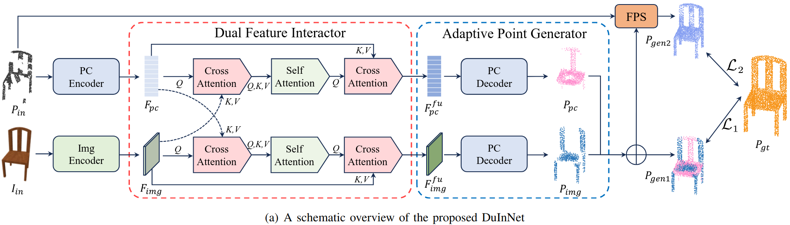
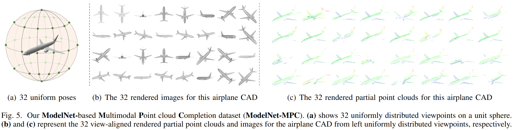

# DuInNet: Dual-Modality Feature Interaction for Point Cloud Completion (IEEE-TMM 2025)

This repository contains the official implementation for "DuInNet: Dual-Modality Feature Interaction for Point Cloud Completion"

Co-authored by Xinpu Liu, Baolin Hou, Hanyun Wang*, Ke Xu, Jianwei Wan and Yulan Guo.





## Introduction

To further promote the development of multimodal point cloud completion, we contribute a large-scale multimodal point cloud completion benchmark ModelNet-MPC with richer shape categories and more diverse test data, which contains nearly 400,000 pairs of high-quality point clouds and rendered images of 40 categories.
Besides the fully supervised point cloud completion task, two additional tasks including denoising completion and zero-shot learning completion are proposed in ModelNet-MPC, to simulate real-world scenarios and verify the robustness to noise and the transfer ability across categories of current methods. 
Meanwhile, considering that existing multimodal completion pipelines usually adopt a unidirectional fusion mechanism and ignore the shape prior contained in the image modality, we propose a Dual-Modality Feature Interaction Network (DuInNet) in this paper.
DuInNet iteratively interacts features between point clouds and images to learn both geometric and texture characteristics of shapes with the dual feature interactor.
To adapt to specific tasks such as fully supervised, denoising, and zero-shot learning point cloud completions, an adaptive point generator is proposed to generate complete point clouds in blocks with different weights for these two modalities. 
Extensive experiments on the ShapeNet-ViPC and ModelNet-MPC benchmarks demonstrate that DuInNet exhibits superiority, robustness and transfer ability in all completion tasks over state-of-the-art methods.

## Install
- python >= 3.6
- PyTorch >= 1.8.0
- CUDA == 11.8

Install requirements
```
pip install -r requirements.txt
```

Install PointNet++ utils, Density-aware Chamfer Distance and Furthest Point Sampling.
```
cd models/pointnet2_batch
python setup.py install

cd ../../metrics/CD/chamfer3D/
python setup.py install

cd ../../EMD/
python setup.py install

cd ../../utils/furthestPointSampling/
python setup.py install
cd ../..

```


### Datasets
1. ShapeNet-ViPC dataset (143GB): [BaiduNetdisk](https://pan.baidu.com/s/1NJKPiOsfRsDfYDU_5MH28A)(code: **ar8l**). Then run ``cat ShapeNetViPC-Dataset.tar.gz* | tar zx``.
2. ModelNet-MPC dataset (20GB, **Ours**): [HuggingFace](https://huggingface.co/datasets/xinpuliu/ModelNetMPC) or [BaiduNetdisk](https://pan.baidu.com/s/1y_sfpd10DSBPiYwj4AYkmA)(code: **nudt**). Then run ``unzip ModelNet-MPC.zip``.
3. ShapeNet-MPC dataset (47GB, **Ours**): [HuggingFace](https://huggingface.co/datasets/xinpuliu/ShapeNetMPC) or [BaiduNetdisk](https://pan.baidu.com/s/1CgXsPJesoyTbabVzuA-47A)(code: **nudt**). Then run ``tar -zxvf ShapeNet-MPC.tgz``.


### Training
```
python main.py
```


### Evaluation
```
python main.py --test
```

## Acknowledgement
The repository is based on [EGIInet](https://github.com/WHU-USI3DV/EGIInet), some of the code and dataset are borrowed from:
- [Meta-Transformer](https://github.com/invictus717/MetaTransformer)
- [SVDFormer](https://github.com/czvvd/SVDFormer_PointSea)
- [ViPC](https://github.com/Hydrogenion/ViPC)
- [XMFnet](https://github.com/diegovalsesia/XMFnet)
- [ModelNet](https://modelnet.cs.princeton.edu/)
- [ShapeNet](https://shapenet.org/)

Thanks for their opensourceing.

## Citation

```
@misc{Liu2024DuInNet,
      title={DuInNet: Dual-Modality Feature Interaction for Point Cloud Completion}, 
      author={Xinpu Liu and Baolin Hou and Hanyun Wang and Ke Xu and Jianwei Wan and Yulan Guo},
      year={2024},
      eprint={2407.07374},
      archivePrefix={arXiv},
      primaryClass={cs.CV},
      url={https://arxiv.org/abs/2407.07374}, 
}
```

## License

This project is open sourced under MIT license.


